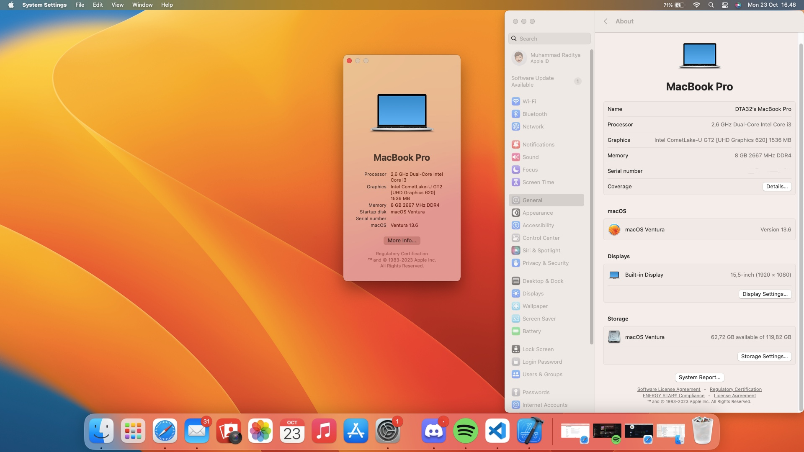

# OpenCore-Ideapad-3-14IML05

> niatnya build from scratch, ketemu error dikit langsung nyerah

Ini bukan project coding, tapi archive settings (lebih tepatnya EFI) yang dipake buat install Hackintosh di laptopku. Fork dari [repo ini](https://github.com/yasapurnama/OpenCore-Ideapad-3-14IML05), tentunya dengan ubahan yang diperlukan supaya compatible. Niatnya sih mau build semua settingan from scratch, tapi baru ketemu error ‘OCB: LoadImage failed - Unsupported’ langsung malas, hehe. EFI pada repository ini compatible dan works di Lenovo Ideapad 3 14IML05 (i3-10110U) using Opencore 0.8.9 with macOS Ventura

minus:

- sleep kadang error
- belum support secure boot (penting untuk valo)

